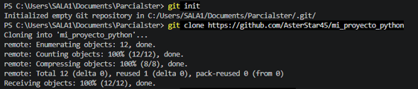
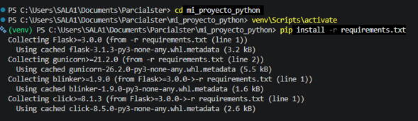
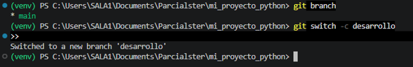
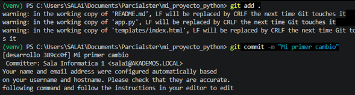
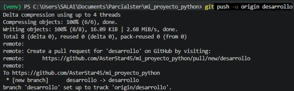
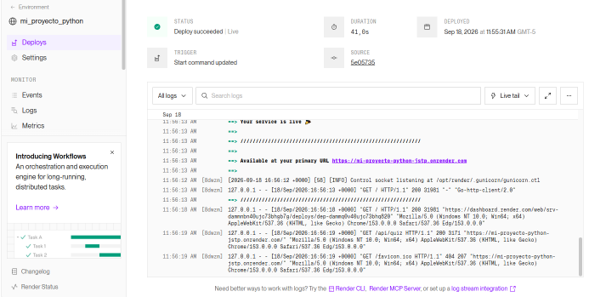
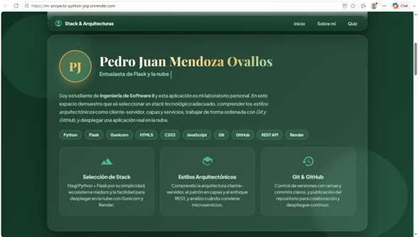

# 🌿 Aplicación Web Flask - Stack & Arquitecturas de Software


Aplicación web construida con **Python** y **Flask**, con una interfaz orgánica inspirada en la
naturaleza (*glassmorphism*, SVG y micro-animaciones). Incluye una **sección creativa personal**, un
**quiz interactivo sobre Stack y Arquitecturas de Software** validado por el servidor, y está lista
para desplegarse en la nube con **Gunicorn** y **Render**.

> 👤 Autor: **Pedro Juan Mendoza Ovallos** — Estudiante de Ingeniería de Software II

---

## 🛠️ Tecnologías Utilizadas

- **Backend**: Python 3, Flask, Gunicorn
- **Frontend**: HTML5, Vanilla CSS3 (Variables CSS, Flexbox, CSS Grid, Glassmorphism, Micro-animaciones)
- **Recursos**: SVG Vectorial puro, Google Fonts (*Playfair Display* & *Plus Jakarta Sans*)
- **Despliegue**: Render, Git & GitHub

---
## 🖼️ Evidencias

Enlace del Fork:
https://github.com/AsterStar45/mi_proyecto_python/tree/main

Pull Request:
https://github.com/g3in-unilasallista/mi_proyecto_python/pull/4

Render:
https://mi-proyecto-python-jstp.onrender.com/

## 🖼️ Evidencias del Proyecto

| | |
|---|---|
|  |  |
|  |  |
|  |  |
|  |

---

## ✨ Funcionalidades

- **Página principal** con hero, estado del servidor y tarjetas ilustrativas del stack elegido.
- **Sección creativa "Sobre mí"** con el nombre del autor, rol animado (efecto de escritura),
  biografía y etiquetas del stack tecnológico.
- **Quiz: Stack y Arquitecturas de Software**
  - Un banco de preguntas sobre stacks tecnológicos y estilos arquitectónicos (monolito, capas,
    cliente-servidor, microservicios, SOA, REST…).
  - Interfaz en JavaScript sin recarga de página.
  - Validación en el servidor Flask: puntaje, porcentaje, estados correcto/incorrecto y
    explicación de cada respuesta.
- **Diseño natural y responsivo** con fondo degradado, efectos de cristal y gráficos vectoriales.

---

## 🛠️ Stack Tecnológico (el porqué de cada pieza)

| Capa | Tecnología | ¿Por qué? |
| ---- | ---------- | --------- |
| Backend | Python + Flask | Simplicidad, ecosistema maduro y rápida curva de aprendizaje. |
| Servidor de producción | Gunicorn | Servidor WSGI estable y eficiente para servir la app en la nube. |
| Frontend | HTML5 + CSS3 + JavaScript | Sin dependencias extra; estilos con variables, Grid y Glassmorphism, y quiz interactivo con Fetch API. |
| Control de versiones | Git + GitHub | Historial claro y colaboración para el despliegue. |
| Nube | Render | Despliegue automático desde GitHub con HTTPS público. |

---

## 🧪 Endpoints de la API

| Método | Ruta                | Descripción                                                        |
| ------ | ------------------- | ------------------------------------------------------------------ |
| `GET`  | `/`                 | Página principal (HTML).                                           |
| `GET`  | `/api/quiz`         | Devuelve las preguntas del quiz en JSON (sin las respuestas).      |
| `POST` | `/api/quiz/submit`  | Recibe `{ "answers": { "<id>": índice } }` y devuelve el resultado. |

Ejemplo de petición:

```json
{
  "answers": { "1": 0, "2": 1, "3": 0 }
}
```

Ejemplo de respuesta:

```json
{
  "score": 8,
  "total": 1,
  "percentage": 80,
  "passed": true,
  "results": [
    { "id": 1, "is_correct": true, "explanation": "..." }
  ]
}
```

---

## 🚀 Ejecutar Localmente

```bash
# 1. Crear y activar el entorno virtual (Windows PowerShell)
python -m venv venv
.\venv\Scripts\Activate.ps1

# 2. Instalar dependencias
pip install -r requirements.txt

# 3. Ejecutar el servidor
python app.py
```

Abre tu navegador en `http://127.0.0.1:5000/`.

---

## 🌐 Despliegue en la Nube (Render)

El archivo `Procfile` indica a la plataforma cómo iniciar la app:

```text
web: gunicorn app:app
```

1. **Subir el proyecto a GitHub:**
   ```bash
   git init
   git add .
   git commit -m "App Flask con sección creativa y quiz de Stack y Arquitecturas"
   git branch -M main
   git remote add origin https://github.com/TU_USUARIO/TU_REPOSITORIO.git
   git push -u origin main
   ```

2. **Configurar en [Render.com](https://render.com):**
   - `+ New` → **Web Service** → conecta GitHub y selecciona el repositorio.
   - **Runtime**: `Python 3`
   - **Build Command**: `pip install -r requirements.txt`
   - **Start Command**: `gunicorn app:app`
   - **Create Web Service** 🎉

Render te entregará un enlace HTTPS público para acceder a tu aplicación desde cualquier dispositivo.

---

## 📂 Estructura del Proyecto

```text
├── app.py               # Servidor Flask + API del quiz
├── Procfile             # Comando de inicio para Render/Heroku
├── requirements.txt     # Dependencias de Python
├── templates/
│   └── index.html       # Página principal (hero, sobre mí y quiz)
├── sources/             # Imágenes/capturas del proyecto
├── venv/                # Entorno virtual (no versionar)
└── README.md
```

---

## 📄 Licencia

MIT — ver archivo [LICENSE](LICENSE).